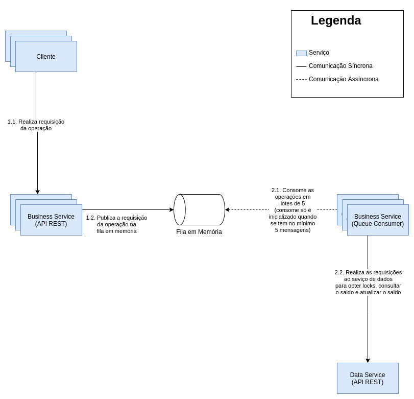

# Projeto

O objetivo do projeto era contruír uma arquitetura para um banco
distruído. Neste banco as operações disponíveis seriam consulta de
saldo, depósitos, saques e transferências.

## Escolhas de arquitetura

### Cliente

Esse programa é responsável por simular o comportamento de um cliente,
solicitando operações diferentes para os servidores de negócio. Ele
recebe uma lista com todos os servidores de negócio e realiza chamadas
de operações aleatórias para um servidor aleatório. Ele funcionou bem
em todos os cenários de teste, com uma instância do servidor de
negócios ou N instacias, como é o caso quando a aplicação sobe com o
docker.

### Serviço de negócio

O serviço de negócio foi o que teve a implementação mais complexa. Já
que ele tinha mais regras que envolviam realizar N chamadas para o
serviço de dados e de forma assíncrona.

A arquitetura do servidor de negócio segue uma arquitetura clássica de
API e worker. Onde temos uma API que a única responsabilidade é enviar
requisições de processamento para um worker por meio de uma estrutura
como uma fila. Desse modo implementamos um background job, que nesse
caso é simplesmente uma thread do mesmo programa, responsável por
consumir de forma assíncrona essa fila e processar as requisições em
micro batches de 5 mensagens.

Tendo as funcionalidades das operações sendo executadas de forma
assíncrona temos um ganho no desacoplamento entre o serviço de negócio
e o serviço de dados. Se o serviço de negócio precisasse realizar as
chamadas ao serviço de dados de forma síncrona significa que qualquer
problema neste serviço refletiria diretamente para o cliente que está
chamando a funcionalidade de negócio. Como a única responsabilidade da
API é enviar a requisição para a fila, o cliente não precisa da
estabilidade de serviço de dados em sua própria requisição.

#### Problemas

- Não há retentativa para as operações realizadas
- As operações não são atômicas, então em casos como o de
  transferência é possível ter contas com saldo em estado
  inconsistente
- O uso de locks de contas poderia ser otimizado se as operações da
  fila fossem agrupadas por conta para realizar o lock apenas uma fez
  e consolidar as entradas e saídas em uma chamada só.

### Serviço de dados

O serviço de dados é o serviço responsável por gerenciar todo direto
aos dados das contas. Por ele é possível atualizar e consultar o saldo
de uma conta e também obter e liberar o lock para uma conta. Todo lock
está atrelado a um serviço de negócio, esses serviços sempre enviam
seu id e o id da conta a ser lockada. Quando o saldo é atualizado esse
lock é validado, o servidor de negócio só pode atualizar o saldo da
conta se ele é o "dono" do lock.

#### Problemas

- Não há transações ACID para as operações
- Dados não são persistidos em disco
- O lock é realizado de forma lógica pelo cliente ao invés de ser
  gerenciado pelo próprio serviço

