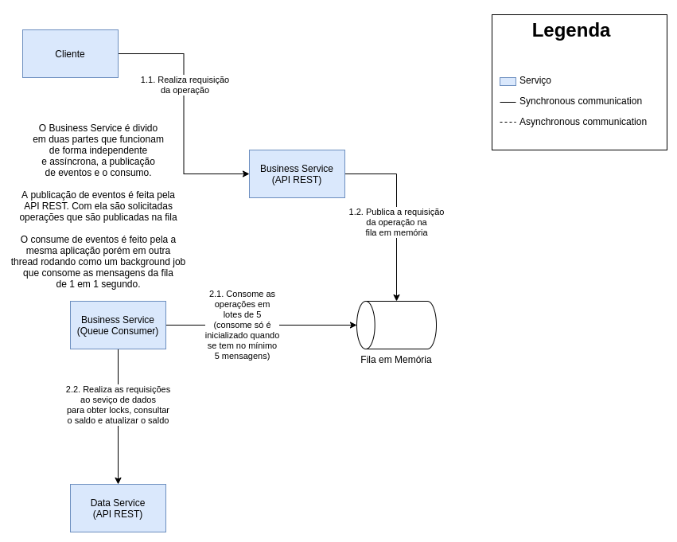

# Business Service (serviço de negócio)

Serviço responsável por implementar as regras de negócio do banco e
expôr a API de operações do banco. As possíveis operações são:

- Depósito
- Saque
- Transferência
- Consulta de saldo

## Arquitetura

## Depósito

## Saque

## Transferência

## Consulta de saldo
