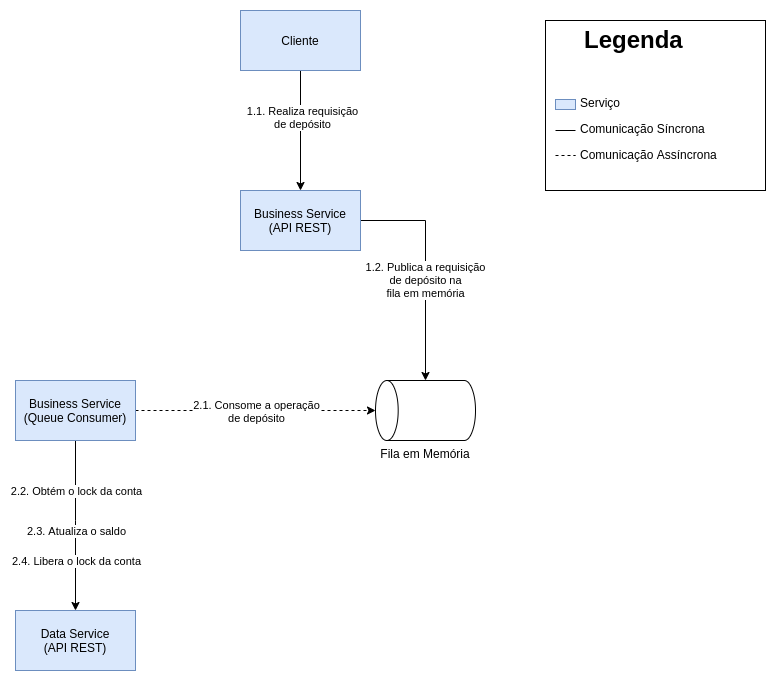
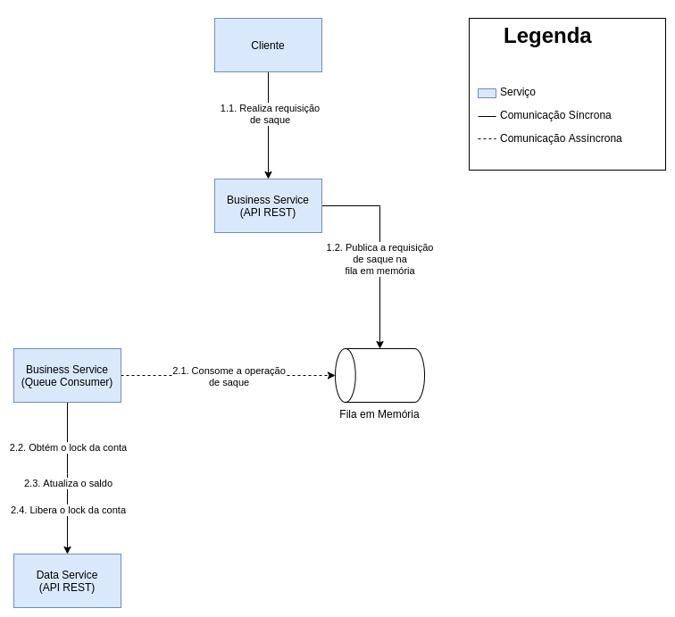
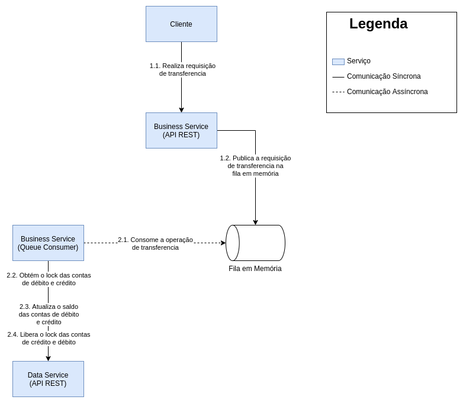

# Business Service (serviço de negócio)

Serviço responsável por implementar as regras de negócio do banco e
expôr a API de operações do banco. As possíveis operações são:

- Consulta de saldo
- Depósito
- Saque
- Transferência

## Arquitetura Geral


## Consulta de saldo


### URI

```
/balance/<int:id_da_conta>
```

### Rodando o curl local

```bash
curl -iX GET -H 'Content-Type: application/json' \
    -H 'Authorization: Basic super-valid-token' \
    http://127.0.0.1:5001/balance/2
```

## Depósito



### URI

```
/deposit/<int:id_da_conta>/<float:valor>
```

### Rodando o curl local

```bash
curl -iX POST -H 'Content-Type: application/json' \
    -H 'Authorization: Basic super-valid-token' \
    http://127.0.0.1:5001/deposit/5/100.0
```

## Saque



### URI

```
/withdraw/<int:id_da_conta>/<float:valor>
```

### Rodando o curl local

```bash
curl -iX POST -H 'Content-Type: application/json' \
    -H 'Authorization: Basic super-valid-token' \
    http://127.0.0.1:5001/withdraw/5/100.0
```

## Transferência



### URI

```
/transfer/<int:id_da_conta_de_debito>/<int:id_da_conta_de_credito>/<float:valor>
```

### Rodando o curl local

```bash
curl -iX POST -H 'Content-Type: application/json' \
    -H 'Authorization: Basic super-valid-token' \
    http://127.0.0.1:5001/tranfer/1/6/100.0
```
